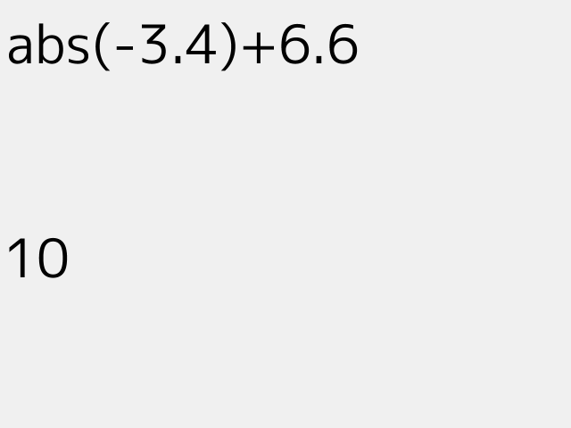

# 電卓
 
```cpp
# include <Siv3D.hpp>

void Main()
{
	Graphics::SetBackground(Color(240));

	const Font font(40);

	String expression;

	while (System::Update())
	{
		Input::GetCharsHelper(expression);

		font(expression).draw(10, 10, Palette::Black);

		if (const auto result = EvaluateOpt(expression))
		{
			font(result.value()).draw(10, 250, Palette::Black);
		}
	}
}
```
