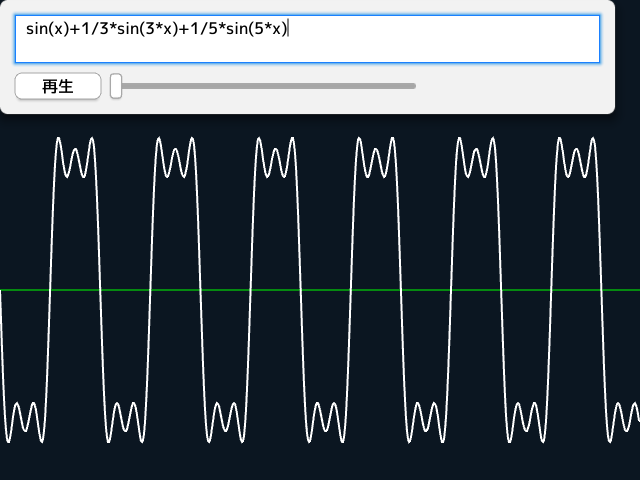

# 音声合成
  
```cpp
# include <Siv3D.hpp>

bool Synthesize(const ParsedExpression& exp, Wave& wave)
{
	if (!exp.isValid() || !exp.evaluateOpt({ { L"x", 0 },{ L"t", 0 },{ L"Pi", Pi },{ L"TwoPi", TwoPi } }))
	{
		return false;
	}

	for (size_t i = 0; i < wave.lengthSample; ++i)
	{
		const double t = i / 44100.0;
		wave[i] = Waving::DoubleToSample(exp.evaluateOpt(
		{ { L"x", 440.0 * t * TwoPi },{ L"t", t }, { L"Pi", Pi },{ L"TwoPi", TwoPi } }).value_or(0.0));
	}

	return true;
}

void Main()
{
	const String defaultExpression = L"sin(x)";
	ParsedExpression f(defaultExpression);

	GUI gui(GUIStyle::Default);
	gui.addln(L"exp", GUITextArea::Create(2, 32));
	gui.add(L"play", GUIButton::Create(L"再生"));
	gui.add(L"scale", GUISlider::Create(1, 10.0, 1, 300));
	gui.textArea(L"exp").setText(defaultExpression);

	Wave wave(3.0s, [](double t){ return Sin(440 * t * TwoPi); });
	Sound sound(wave);
	sound.setVolume(0.3);

	LineString lines(6400, Vec2(0,0));

	while (System::Update())
	{
		if (gui.textArea(L"exp").hasChanged)
		{
			if (Synthesize(ParsedExpression(gui.textArea(L"exp").text), wave))
			{
				sound.fill(wave);
				gui.textArea(L"exp").style.color = Palette::Black;
			}
			else
			{
				gui.textArea(L"exp").style.color = Palette::Red;
			}
		}

		gui.button(L"play").enabled = !sound.isPlaying();

		if (gui.button(L"play").pushed)
		{
			sound.play();
		}

		const double s = gui.slider(L"scale").value;
		const int32 count = static_cast<int32>(640 * s);

		for (size_t i = 0; i < count; ++i)
		{
			lines.point(i).set(i * (1.0 / s), 290 + wave[static_cast<int32>(i * s)].left / 200);
		}

		Line(0, 290, 640, 290).draw(Color(0, 255, 0));

		lines.substr(0, count).draw(2);
	}
}
```
