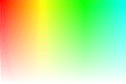
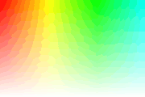

# AnimatedGIFWriter

一連の `Image` から GIF アニメーションファイルを作成します。

## AnimatedGIFWriter の使用例

```cpp
# include <Siv3D.hpp>

void Main()
{
	const Font font(40);
	const Size size(180, 120);
	Image image(size);

	AnimatedGIFWriter gifWriter(L"animation.gif", size, false);

	for (auto i : step(60))
	{
		image.fill(HSV(i * 2, 0.5, 1.0));

		Circle(size / 2, i * 2).writeFrame(image, 0, 10, Palette::White);

		font(i / 10).writeCenter(image);

		gifWriter.writeFrame(image, 10);
	}
}
```
作成される GIF アニメーション 
  


## ディザリングの有無

ディザリングを有効にすると、処理時間の増大と引き換えに、色の階調をなめらかにします。

```cpp
# include <Siv3D.hpp>

void Main()
{
	const Font font(40);
	const Size size(180, 120);
	Image image(size);

	AnimatedGIFWriter gifWriterDither(L"animation-dither.gif", size, true);
	AnimatedGIFWriter gifWriterNoDither(L"animation-nodither.gif", size, false);

	for (auto i : step(20))
	{
		for (int32 y = 0; y < image.height; ++y)
		{
			for (int32 x = 0; x < image.width; ++x)
			{
				image[y][x] = HSV(i * 2 + x, 1.0 - (static_cast<double>(y) / image.height), 1.0);
			}
		}

		gifWriterDither.writeFrame(image, 10);
		gifWriterNoDither.writeFrame(image, 10);
	}
}
```
作成される GIF アニメーション（**左:** ディザリング有効　**右:** ディザリング無効） 
  


