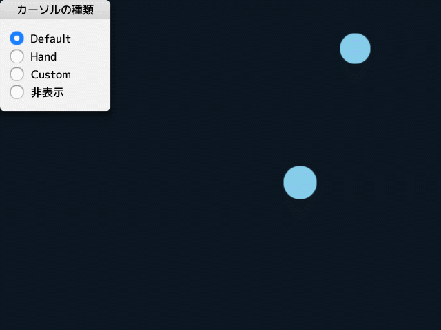

# Cursor

マウスカーソルの位置やスタイルを設定します。

## マウスカーソルのスタイルを変更する

```cpp
# include <Siv3D.hpp>

Image CreateCustomCursor()
{
	Image image(50, 50, Color(0, 0));

	Circle(25, 25, 15).overwriteFrame(image, 1, 0, Palette::Red);

	Line(0, 25, 50, 25).overwrite(image, Palette::Red);

	Line(25, 0, 25, 50).overwrite(image, Palette::Red);

	return image;
}

void Main()
{
	GUI gui(GUIStyle::Default);
	gui.setTitle(L"カーソルの種類");
	gui.add(L"style", GUIRadioButton::Create({ L"Default", L"Hand", L"Custom", L"非表示" }, 0u, true));
	gui.style.width = 160;

	const Texture texture(CreateCustomCursor());

	Array<Circle> circles;

	Stopwatch stopwatch(true);

	while (System::Update())
	{
		if (gui.radioButton(L"style").hasChanged)
		{
			switch (gui.radioButton(L"style").checkedItem.value())
			{
			case 0:
				Cursor::SetStyle(CursorStyle::Default);
				break;
			case 1:
				Cursor::SetStyle(CursorStyle::Hand);
				break;
			case 2:
				Cursor::SetStyle(CursorStyle::Custom(texture, { 20, 20 }));
				break;
			case 3:
				Cursor::SetStyle(CursorStyle::None);
				break;
			}
		}

		if (stopwatch.elapsed() > 600ms && circles.size() < 100)
		{
			circles.emplace_back(RandomPoint({ 160, 640 }, { 0, 480 }), Random(15, 50));

			stopwatch.restart();
		}

		Erase_if(circles, [](const Circle& c) { return c.leftClicked; });

		for (const auto& circle : circles)
		{
			circle.draw(circle.mouseOver ? Palette::Yellow : Palette::Skyblue);
		}
	}
}
```

## 現在のマウスカーソルのスタイルを取得する

```cpp
# include <Siv3D.hpp>

void Main()
{
	const CursorStyle style = Cursor::GetStyle();

	while (System::Update())
	{

	}
}
```

## マウスカーソルの位置を移動する

```cpp
# include <Siv3D.hpp>

void Main()
{
	while (System::Update())
	{
		if (Input::MouseL.clicked)
		{
			Cursor::SetPos(Window::Center());
		}
	}
}
```

