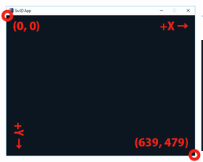
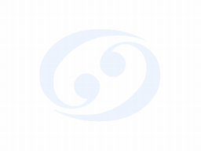

# Siv3D リファレンス | January 2016
> 一部の実行環境で Siv3D January 2016 アプリの起動時にロゴ表示でクラッシュすることがあった問題を修正しました。現在配布している Siv3D Package は修正を適用しています。1 月 15 日 23:00 以前にインストールした方は差し替えを推奨します。

- <a href="http://play-siv3d.hateblo.jp/" target="_blank">Siv3D とは</a>  
- <a href="What's New/ReleaseNotes.md" target="_blank">Siv3D January 2016 リリースノート</a>  
- <a href="What's New/Features.md" target="_blank">Siv3D January 2016 の新機能サンプル</a>  

#### インストール方法
- <a href="Install/System-requirements.md" target="_blank">動作環境</a>  
- <a href="Install/Manual-setup.md" target="_blank">セットアップ手順</a>  

#### サポート・その他
- <a href="http://play-siv3d.hateblo.jp/entry/slack" target="_blank">ユーザーグループ Slack</a>  
- <a href="http://siv3d.jp/bbs/patio.cgi" target="_blank">ユーザー掲示板</a>  
- <a href="Work in Progress/Work-in-progress.md" target="_blank">開発中の機能</a>  

### 入門チュートリアル
| | | |
|:---------:|:---------:|:---------:|
| 1. Siv3D の基本| 2. 図形を描く| 3. テクスチャを描く|
| 4. テキストを描く| 5. 文字列と数値の変換| 6. キーボード入力|
| 7. マウス入力| 8. サウンドの再生| 9. MIDI の再生|
| 10. ウィンドウと背景| 11. 図形のあたり判定| 12. 乱数|
| 13. ダイアログ| 14. ドラッグ & ドロップ| 15. アプリの状態|
| 16. テキストファイル| 17. INI, CSV, JSON| 18. バイナリファイル|
| 19. GUI| 20. アセット管理| 21. 画像編集|
| 22. Web カメラ| 23. マイク入力| 24. 経過時間の測定|
| 25. HSV カラー| 26. ファイルダウンロード| 27. 3D 描画|
| 28. 2D のレンダーステート| 29. 3D のレンダーステート| 30. パーティクル|
| 31. スクリーンショット| 32. アプリケーションの公開| 番外編：さらに学ぶには|

### サンプル集
| | | |
|:---------:|:---------:|:---------:|
| スケッチブック| 画像ビューア| オーディオスペクトラム|
| マイク入力スペクトラム| 文字色の反転| 天気予報|
| ドットお絵かき| 15 パズル| ブロックくずし|
| 時計| 音楽プレイヤー| ピアノ|
| ライフゲーム| シーン管理| 地球|
| 3D シーン| Leap Motion| 3D 交差判定|
| Wooden Mirror| シューティングゲーム| Image to Polygon|
| Sketch to Polygon| 軌跡| Plot3D|
| テンポとピッチの変更| 長方形の影| Twitter クライアント|
| Polygon to Mesh| 3D テキスト| アプリ終了の確認|
| 地形| アーカイブファイル| GUI のアニメーション|
| Aero Glass エフェクト| Glitch| カスタム GUI|
| リンクテキスト| 付箋|<a href="Examples/SceneChangeSilhouette.md" target="_blank">")</a> シーン切り替え(シルエット)|
| MIDI シーケンサー| 数つなぎ| 画面を揺らす|
| 対称定規| aobench| MIDI ビジュアライザー|
| 電卓| 手書き文字認識| 顔検出|
| Xbox 360 コントローラ| Kinect v1| Kinect v2|
| 音声合成| | |

### プログラミングガイド（順次アップデート）

#### アプリ開発のテクニック
|   テーマ   |   概要    |
|:---------|:---------|
|	<a href="Programming Guide/Splash.md" target="_blank">スプラッシュウィンドウ</a>	|	アプリ起動時に表示されるロゴ画像をカスタマイズする方法	|
|	<a href="Programming Guide/Resource.md" target="_blank">ファイルの埋め込み</a>	|	画像や音声、テキストファイルを .exe ファイルに埋め込む方法	|

#### モジュール別リファレンス

|   モジュール   |   機能概要    |
|:---------|:---------|
|   <a href="Programming Guide/Addon.md" target="_blank">Addon</a>  |   アドオン    |
|	<a href="Programming Guide/AnimatedGIFWriter.md" target="_blank">AnimatedGIFWriter</a> 	|	GIF アニメーションの書き出し	|
|	<a href="Programming Guide/ApplicationUtility.md" target="_blank">ApplicationUtility</a>	|	簡易テキスト出力	|
|	<a href="Programming Guide/Headers/Siv3D/AR.hpp" target="_blank">AR</a>	|	AR マーカー	|
|	<a href="Programming Guide/Headers/Siv3D/ArchivedFileReader.hpp" target="_blank">ArchivedFileReader</a>	|	アーカイブファイルからの読み込み	|
|	<a href="Programming Guide/Headers/Siv3D/Array.hpp" target="_blank">Array</a>	|	動的配列	|
|	<a href="Programming Guide/Headers/Siv3D/Arrow.hpp" target="_blank">Arrow</a>	|	矢印形（2D 図形）	|
|	<a href="Programming Guide/Asset.md" target="_blank">Asset</a>	|	アセット管理	|
|	<a href="Programming Guide/Headers/Siv3D/Base64.hpp" target="_blank">Base64</a>	|	Base64	|
|	<a href="Programming Guide/Headers/Siv3D/BinaryReader.hpp" target="_blank">BinaryReader</a>	|	バイナリファイルの読み込み	|
|	<a href="Programming Guide/Headers/Siv3D/BinaryWriter.hpp" target="_blank">BinaryWriter</a>	|	バイナリファイルの書き込み	|
|	<a href="Programming Guide/Headers/Siv3D/BlendState.hpp" target="_blank">BlendState</a>	|	ブレンドステート	|
|	<a href="Programming Guide/Headers/Siv3D/BoolArray.hpp" target="_blank">BoolArray</a>	|	bool 型の動的配列	|
|	<a href="Programming Guide/Headers/Siv3D/Box.hpp" target="_blank">Box</a>	|	ボックス（3D 形状）   |
|	Box2D	|	物理演算ライブラリ Box2D	|
|	<a href="Programming Guide/Headers/Siv3D/ByteArray.hpp" target="_blank">ByteArray</a>	|	読み込み用バッファ	|
|	<a href="Programming Guide/Headers/Siv3D/Camera.hpp" target="_blank">Camera</a>	|	3D カメラ	|
|	<a href="Programming Guide/Headers/Siv3D/Char.hpp" target="_blank">Char</a>	|	文字	|
|	<a href="Programming Guide/CharacterSet.md" target="_blank">CharacterSet</a>	|	文字コード変換	|
|	<a href="Programming Guide/Headers/Siv3D/Circle.hpp" target="_blank">Circle</a>	|	円（2D 図形）	|
|	<a href="Programming Guide/Headers/Siv3D/Circular.hpp" target="_blank">Circular</a>	|	円座標	|
|	<a href="Programming Guide/Headers/Siv3D/Clipboard.hpp" target="_blank">Clipboard</a>	|	クリップボード	|
|	<a href="Programming Guide/Headers/Siv3D/Color.hpp" target="_blank">Color</a>	|	RGB カラー	|
|	<a href="Programming Guide/Headers/Siv3D/CommandLine.hpp" target="_blank">CommandLine</a>	|	コマンドライン	|
|	<a href="Programming Guide/Headers/Siv3D/Compression.hpp" target="_blank">Compression</a>	|	Deflate によるデータの圧縮・展開	|
|	<a href="Programming Guide/Headers/Siv3D/Cone.hpp" target="_blank">Cone</a>	|	円錐（3D 形状）	|
|	<a href="Programming Guide/Console.md" target="_blank">Console</a>	|	コンソールウィンドウ	|
|	<a href="Programming Guide/Headers/Siv3D/ConstantBuffer.hpp" target="_blank">ConstantBuffer</a>	|	シェーダの定数バッファ	|
|	<a href="Programming Guide/Headers/Siv3D/Crypto.hpp" target="_blank">Crypto</a>	|	AES128 による暗号化	|
|	<a href="Programming Guide/Headers/Siv3D/CSVReader.hpp" target="_blank">CSVReader</a>	|	CSV ファイルの読み込み	|
|	<a href="Programming Guide/Headers/Siv3D/CSVWriter.hpp" target="_blank">CSVWriter</a>	|	CSV ファイルの書き出し	|
|	<a href="Programming Guide/Headers/Siv3D/CubicBezier.hpp" target="_blank">CubicBezier</a>	|	3 次ベジェ曲線	|
|	<a href="Programming Guide/Cursor.md" target="_blank">Cursor</a>	|	カーソル	|
|	<a href="Programming Guide/Headers/Siv3D/CustomColor.hpp" target="_blank">CustomColor</a>	|	カスタムカラーフォーマット	|
|	<a href="Programming Guide/Headers/Siv3D/CustomImage.hpp" target="_blank">CustomImage</a>	|	カスタムカラーフォーマットの画像	|
|	<a href="Programming Guide/Headers/Siv3D/Cylinder.hpp" target="_blank">Cylinder</a>	|	円柱（3D 形状）	|
|	<a href="Programming Guide/Headers/Siv3D/Cylindrical.hpp" target="_blank">Cylindrical</a>	|	円柱座標	|
|	<a href="Programming Guide/Headers/Siv3D/Date.hpp" target="_blank">Date</a>	|	日付	|
|	<a href="Programming Guide/Headers/Siv3D/DateTime.hpp" target="_blank">DateTime</a>	|	日付と時刻	|
|	<a href="Programming Guide/Headers/Siv3D/DepthStencilState.hpp" target="_blank">DepthStencilState</a>	|	デプスステートとステンシルステート	|
|	<a href="Programming Guide/Headers/Siv3D/Dialog.hpp" target="_blank">Dialog</a>	|	ダイアログ	|
|	<a href="Programming Guide/Headers/Siv3D/DirectXMathUtility.hpp" target="_blank">DirectXMathUtility</a>	|	DirectXMath ユーティリティ	|
|	<a href="Programming Guide/Headers/Siv3D/Disc.hpp" target="_blank">Disc</a>	|	円盤（3D 形状）	|
|	<a href="Programming Guide/Headers/Siv3D/Distribution.hpp" target="_blank">Distribution</a>	|	乱数の分布	|
|	<a href="Programming Guide/Headers/Siv3D/Dragdrop.hpp" target="_blank">Dragdrop</a>	|	ドラッグ & ドロップ	|
|	<a href="Programming Guide/Headers/Siv3D/Duration.hpp" target="_blank">Duration</a>	|	時間の単位	|
|	<a href="Programming Guide/Headers/Siv3D/DynamicMesh.hpp" target="_blank">DynamicMesh</a>	|	動的メッシュ	|
|	<a href="Programming Guide/Headers/Siv3D/DynamicTexture.hpp" target="_blank">DynamicTexture</a>	|	動的テクスチャ	|
|	<a href="Programming Guide/Headers/Siv3D/Easing.hpp" target="_blank">Easing</a>	|	イージング関数	|
|	<a href="Programming Guide/Headers/Siv3D/EasingController.hpp" target="_blank">EasingController</a>	|	イージング ユーティリティ	|
|	<a href="Programming Guide/Effect.md" target="_blank">Effect</a>	|	エフェクト	|
|	<a href="Programming Guide/Headers/Siv3D/Ellipse.hpp" target="_blank">Ellipse</a>	|	楕円（2D 図形）	|
|	<a href="Programming Guide/Headers/Siv3D/EventTimer.hpp" target="_blank">EventTimer</a>	|	イベント付きストップウォッチ	|
|	<a href="Programming Guide/Headers/Siv3D/ExpressionParser.hpp" target="_blank">ExpressionParser</a>	|	数式パーサー	|
|	<a href="Programming Guide/Headers/Siv3D/FFT.hpp" target="_blank">FFT</a>	|	FFT	|
|	<a href="Programming Guide/Headers/Siv3D/FileArchive.hpp" target="_blank">FileArchive</a>	|	アーカイブファイル	|
|	<a href="Programming Guide/Headers/Siv3D/FileMonitor.hpp" target="_blank">FileMonitor</a>	|	ファイルとディレクトリの変更の監視	|
|	<a href="Programming Guide/Headers/Siv3D/FileSystem.hpp" target="_blank">FileSystem</a>	|	ファイルとディレクトリ	|
|	<a href="Programming Guide/Headers/Siv3D/FloatShape.hpp" target="_blank">FloatShape</a>	|	レンダリング用形状	|
|	<a href="Programming Guide/Headers/Siv3D/Fog.hpp" target="_blank">Fog</a>	|	フォグの設定（3D 描画）	|
|	<a href="Programming Guide/Headers/Siv3D/Font.hpp" target="_blank">Font</a>	|	フォント	|
|	<a href="Programming Guide/Headers/Siv3D/FontAsset.hpp" target="_blank">FontAsset</a>	|	Font アセット	|
|	<a href="Programming Guide/Headers/Siv3D/Format.hpp" target="_blank">Format</a>	|	データ → 文字列 の変換	|
|	<a href="Programming Guide/Headers/Siv3D/Gamepad.hpp" target="_blank">Gamepad</a>	|	ゲームパッド	|
|	<a href="Programming Guide/Headers/Siv3D/Geometry2D.hpp" target="_blank">Geometry2D</a>	|	2D 幾何	|
|	<a href="Programming Guide/Headers/Siv3D/Geometry3D.hpp" target="_blank">Geometry3D</a>	|	3D 幾何	|
|	<a href="Programming Guide/Headers/Siv3D/Graphics.hpp" target="_blank">Graphics</a>	|	グラフィックス全般	|
|	<a href="Programming Guide/Headers/Siv3D/Graphics2D.hpp" target="_blank">Graphics2D</a>	|	2D グラフィックス設定	|
|	<a href="Programming Guide/Headers/Siv3D/Graphics3D.hpp" target="_blank">Graphics3D</a>	|	3D グラフィックス設定	|
|	<a href="Programming Guide/Headers/Siv3D/Grid.hpp" target="_blank">Grid</a>	|	動的二次元配列	|
|	<a href="Programming Guide/Headers/Siv3D/GUI.hpp" target="_blank">GUI</a>	|	GUI	|
|	<a href="Programming Guide/Headers/Siv3D/GUIAsset.hpp" target="_blank">GUIAsset</a>	|	GUI アセット	|
|	<a href="Programming Guide/Headers/Siv3D/GUIButton.hpp" target="_blank">GUIButton</a>	|	ボタン（GUI ウィジェット）	|
|	<a href="Programming Guide/Headers/Siv3D/GUICheckBox.hpp" target="_blank">GUICheckBox</a>	|	チェックボック（GUI ウィジェット）	|
|	<a href="Programming Guide/Headers/Siv3D/GUIColorPalette.hpp" target="_blank">GUIColorPalette</a>	|	カラーパレット（GUI ウィジェット）	|
|	<a href="Programming Guide/Headers/Siv3D/GUIHorizontalLine.hpp" target="_blank">GUIHorizontalLine</a>	|	水平線（GUI ウィジェット）	|
|	<a href="Programming Guide/Headers/Siv3D/GUINewLine.hpp" target="_blank">GUINewLine</a>	|	改行（GUI ウィジェット）	|
|	<a href="Programming Guide/Headers/Siv3D/GUIRadioButton.hpp" target="_blank">GUIRadioButton</a>	|	ラジオボタン（GUI ウィジェット）	|
|	<a href="Programming Guide/Headers/Siv3D/GUISlider.hpp" target="_blank">GUISlider</a>	|	水平スライダー（GUI ウィジェット）	|
|	<a href="Programming Guide/Headers/Siv3D/GUIText.hpp" target="_blank">GUIText</a>	|	テキスト（GUI ウィジェット）	|
|	<a href="Programming Guide/Headers/Siv3D/GUITextArea.hpp" target="_blank">GUITextArea</a>	|	テキスト入力エリア（GUI ウィジェット）	|
|	<a href="Programming Guide/Headers/Siv3D/GUITextField.hpp" target="_blank">GUITextField</a>	|	テキスト入力フィールド（GUI ウィジェット）	|
|	<a href="Programming Guide/Headers/Siv3D/GUITexture.hpp" target="_blank">GUITexture</a>	|	テクスチャ（GUI ウィジェット）	|
|	<a href="Programming Guide/Headers/Siv3D/GUIToggleSwitch.hpp" target="_blank">GUIToggleSwitch</a>	|	トグルスイッチ（GUI ウィジェット）	|
|	<a href="Programming Guide/Headers/Siv3D/ .hpp" target="_blank">HalfFloat</a>	|	半精度浮動小数点数	|
|	<a href="Programming Guide/Headers/Siv3D/HandwritingRecognizer.hpp" target="_blank">HandwritingRecognizer</a>	|	手書き文字認識	|
|	<a href="Programming Guide/Headers/Siv3D/HandwritingTrainer.hpp" target="_blank">HandwritingTrainer</a>	|	手書き文字認識用の学習データ作成	|
|	<a href="Programming Guide/Headers/Siv3D/HighPerfoemanceGraphics.hpp" target="_blank">HighPerfoemanceGraphics</a>	|	GPU の使用	|
|	<a href="Programming Guide/Headers/Siv3D/HSV.hpp" target="_blank">HSV</a>	|	HSV カラー	|
|	<a href="Programming Guide/Headers/Siv3D/HTTPClient.hpp" target="_blank">HTTPClient</a>	|	HTTP	|
|	<a href="Programming Guide/Headers/Siv3D/INIReader.hpp" target="_blank">INIReader</a>	|	INI ファイルの読み込み	|
|	<a href="Programming Guide/Headers/Siv3D/INIWriter.hpp" target="_blank">INIWriter</a>	|	INI ファイルの書き出し	|
|	<a href="Programming Guide/Headers/Siv3D/Input.hpp" target="_blank">Input</a>	|	入力全般	|
|	<a href="Programming Guide/Headers/Siv3D/InputLayout.hpp" target="_blank">InputLayout</a>	|	頂点レイアウト	|
|	<a href="Programming Guide/Headers/Siv3D/Internet.hpp" target="_blank">Internet</a>	|	インターネット	|
|	<a href="Programming Guide/Headers/Siv3D/IReader.hpp" target="_blank">IReader</a>	|	IReader インタフェース	|
|	<a href="Programming Guide/Headers/Siv3D/IWidget.hpp" target="_blank">IWidget</a>	|	IWidget インタフェース	|
|	<a href="Programming Guide/Headers/Siv3D/IWriter.hpp" target="_blank">IWriter</a>	|	IWriter インタフェース	|
|	<a href="Programming Guide/Headers/Siv3D/Image.hpp" target="_blank">Image</a>	|	画像処理	|
|	<a href="Programming Guide/Headers/Siv3D/JSONReader.hpp" target="_blank">JSONReader</a>	|	JSON ファイルの読み込み	|
|	<a href="Programming Guide/Headers/Siv3D/JSONValue.hpp" target="_blank">JSONValue</a>	|	JSON のデータ	|
|	<a href="Programming Guide/Headers/Siv3D/Key.hpp" target="_blank">Key</a>	|	キー入力	|
|	<a href="Programming Guide/Headers/Siv3D/KinectV1.hpp" target="_blank">KinectV1</a>	|	Kinect v1	|
|	<a href="Programming Guide/Headers/Siv3D/KinectV2.hpp" target="_blank">KinectV2</a>	|	Kinect v2	|
|	<a href="Programming Guide/Headers/Siv3D/KineticTypography.hpp" target="_blank">KineticTypography</a>	|	キネティックタイポグラフィ	|
|	<a href="Programming Guide/Headers/Siv3DAddon/LeapMotion.hpp" target="_blank">LeapMotion</a>	|	Leap Motion	|
|	<a href="Programming Guide/Headers/Siv3D/Lerp.hpp" target="_blank">Lerp</a>	|	線形補間	|
|	<a href="Programming Guide/Headers/Siv3D/Light.hpp" target="_blank">Light</a>	|	ライティングの設定（3D 描画）	|
|	<a href="Programming Guide/Headers/Siv3D/Line.hpp" target="_blank">Line</a>	|	線分（2D 図形）	|
|	<a href="Programming Guide/Headers/Siv3D/Line3D.hpp" target="_blank">Line3D</a>	|	線分（3D 形状）	|
|	<a href="Programming Guide/Headers/Siv3D/LineString.hpp" target="_blank">LineString</a>	|	連続した複数の線分（2D 図形）	|
|	<a href="Programming Guide/Headers/Siv3D/Logger.hpp" target="_blank">Logger</a>	|	ログファイル	|
|	<a href="Programming Guide/Headers/Siv3D/Mat3x2.hpp" target="_blank">Mat3x2</a>	|	3x2 行列	|
|	<a href="Programming Guide/Headers/Siv3D/Mat4x4.hpp" target="_blank">Mat4x4</a>	|	4x4 行列	|
|	<a href="Programming Guide/Headers/Siv3D/Math.hpp" target="_blank">Math</a>	|	数学関数	|
|	<a href="Programming Guide/Headers/Siv3D/MathConstants.hpp" target="_blank">MathConstants</a>	|	数学定数	|
|	<a href="Programming Guide/Headers/Siv3D/MD5.hpp" target="_blank">MD5</a>	|	MD5	|
|	<a href="Programming Guide/Headers/Siv3D/MediaPlayer.hpp" target="_blank">MediaPlayer</a>	|	メディアプレイヤー (AVI, WMV, MP4 等に対応)	|
|	<a href="Programming Guide/Headers/Siv3D/MemoryWriter.hpp" target="_blank">MemoryWriter</a>	|	書き込み用バッファ	|
|	<a href="Programming Guide/Headers/Siv3D/Mesh.hpp" target="_blank">Mesh</a>	|	3D メッシュ	|
|	<a href="Programming Guide/Headers/Siv3D/MeshData.hpp" target="_blank">MeshData</a>	|	3D メッシュデータ	|
|	<a href="Programming Guide/Headers/Siv3D/MessageBox.hpp" target="_blank">MessageBox</a>	|	メッセージボックス	|
|	<a href="Programming Guide/Headers/Siv3D/Midi.hpp" target="_blank">Midi</a>	|	MIDI	|
|	<a href="Programming Guide/Headers/Siv3D/Model.hpp" target="_blank">Model</a>	|	3D モデルデータ	|
|	<a href="Programming Guide/Headers/Siv3D/ModelLoader.hpp" target="_blank">ModelLoader</a>	|	OBJ ファイル読み込み	|
|	<a href="Programming Guide/Headers/Siv3D/Mouse.hpp" target="_blank">Mouse</a>	|	マウス	|
|	<a href="Programming Guide/Headers/Siv3D/MultiPolygon.hpp" target="_blank">MultiPolygon</a>	|	多角形の集合（2D 図形）	|
|	<a href="Programming Guide/Namespace.md" target="_blank">Namespace</a>	|	ライブラリ名前空間の設定	|
|	<a href="Programming Guide/Headers/Siv3D/Network.hpp" target="_blank">Network</a>	|	ネットワーク	|
|	<a href="Programming Guide/Headers/Siv3D/Number.hpp" target="_blank">Number</a>	|	数値	|
|	<a href="Programming Guide/Headers/Siv3D/Optional.hpp" target="_blank">Optional</a>	|	無効値表現型	|
|	<a href="Programming Guide/Headers/Siv3D/Parse.hpp" target="_blank">Parse</a>	|	文字列 → データ の変換	|
|	<a href="Programming Guide/Headers/Siv3D/Particle.hpp" target="_blank">Particle</a>	|	3D パーティクル	|
|	<a href="Programming Guide/Headers/Siv3D/Pentablet.hpp" target="_blank">Pentablet</a>	|	ペンタブレット	|
|	<a href="Programming Guide/Headers/Siv3D/PerlinNoise.hpp" target="_blank">PerlinNoise</a>	|	Perlin Noise	|
|	<a href="Programming Guide/Headers/Siv3D/PixelShader.hpp" target="_blank">PixelShader</a>	|	ピクセルシェーダ	|
|	<a href="Programming Guide/Headers/Siv3D/Plane.hpp" target="_blank">Plane</a>	|	平面（3D 形状）	|
|	<a href="Programming Guide/Headers/Siv3D/Point.hpp" target="_blank">Point</a>	|	点、またはサイズ（2D 図形）	|
|	<a href="Programming Guide/Headers/Siv3D/Polygon.hpp" target="_blank">Polygon</a>	|	多角形（2D 図形）	|
|	<a href="Programming Guide/Headers/Siv3D/PostEffect.hpp" target="_blank">PostEffect</a>	|	ポストエフェクト	|
|	<a href="Programming Guide/Headers/Siv3D/Profiler.hpp" target="_blank">Profiler</a>	|	プロファイリング	|
|	<a href="Programming Guide/Headers/Siv3D/ProfilerUtility.hpp" target="_blank">ProfilerUtility</a>	|	処理にかかった時間の測定	|
|	<a href="Programming Guide/Headers/Siv3D/PyFmt.hpp" target="_blank">PyFmt</a>	|	Python 風の文字列フォーマット	|
|	<a href="Programming Guide/Headers/Siv3D/QR.hpp" target="_blank">QR</a>	|	QR コードの作成と認識	|
|	<a href="Programming Guide/Headers/Siv3D/Quad.hpp" target="_blank">Quad</a>	|	四角形（2D 図形）	|
|	<a href="Programming Guide/Headers/Siv3D/QuadraticBezier.hpp" target="_blank">QuadraticBezier</a>	|	2 次ベジェ曲線	|
|	<a href="Programming Guide/Headers/Siv3D/Quaternion.hpp" target="_blank">Quaternion</a>	|	クォータニオン	|
|	<a href="Programming Guide/Headers/Siv3D/Random.hpp" target="_blank">Random</a>	|	乱数ユーティリティ	|
|	<a href="Programming Guide/Headers/Siv3D/RasterizerState.hpp" target="_blank">RasterizerState	</a>|	ラスタライザーステート	|
|	<a href="Programming Guide/Headers/Siv3D/Ray.hpp" target="_blank">Ray</a>	|	レイ	|
|	<a href="Programming Guide/Headers/Siv3D/Recorder.hpp" target="_blank">Recorder</a>	|	マイク入力	|
|	<a href="Programming Guide/Headers/Siv3D/Rectangle.hpp" target="_blank">Rectangle</a>	|	長方形（2D 図形）	|
|	<a href="Programming Guide/Headers/Siv3D/Regex.hpp" target="_blank">Regex</a>	|	正規表現	|
|	<a href="Programming Guide/Headers/Siv3D/RenderState.hpp" target="_blank">RenderState</a>	|	レンダーステート	|
|	<a href="Programming Guide/Headers/Siv3D/RenderTexture.hpp" target="_blank">RenderTexture</a>	|	レンダーテクスチャ	|
|	<a href="Programming Guide/Headers/Siv3D/RNG.hpp" target="_blank">RNG</a>	|	乱数生成エンジン	|
|	<a href="Programming Guide/Headers/Siv3D/RoundRect.hpp" target="_blank">RoundRect</a>	|	角丸長方形（2D 図形）	|
|	<a href="Programming Guide/Headers/Siv3D/SamplerState.hpp" target="_blank">SamplerState</a>	|	サンプラーステート	|
|	<a href="Programming Guide/Headers/HamFramework/SceneManager.hpp" target="_blank">SceneManager</a>	|	シーン管理	|
|	<a href="Programming Guide/Headers/Siv3D/ScreenCapture.hpp" target="_blank">ScreenCapture</a>	|	スクリーンショット	|
|	<a href="Programming Guide/Headers/Siv3D/Serial.hpp" target="_blank">Serial</a>	|	シリアル通信	|
|	<a href="Programming Guide/Headers/Siv3D/Serialization.hpp" target="_blank">Serialization</a>	|	シリアライゼーション	|
|	<a href="Programming Guide/Headers/Siv3D/Shader.hpp" target="_blank">Shader</a>	|	シェーダのコンパイル	|
|	<a href="Programming Guide/Headers/Siv3D/Shape.hpp" target="_blank">Shape</a>	|	2D 図形の Variant	|
|	<a href="Programming Guide/Headers/Siv3D/SIMD.hpp" target="_blank">SIMD</a>	|	SIMD	|
|	<a href="Programming Guide/Headers/Siv3D/Sound.hpp" target="_blank">Sound</a>	|	サウンド	|
|	<a href="Programming Guide/Headers/Siv3D/SoundAsset.hpp" target="_blank">SoundAsset</a>	|	Sound アセット	|
|	<a href="Programming Guide/Headers/Siv3D/SoundBeat.hpp" target="_blank">SoundBeat</a>	|	サウンドの拍カウント	|
|	<a href="Programming Guide/Headers/Siv3D/Sphere.hpp" target="_blank">Sphere</a>	|	球（3D 形状）	|
|	<a href="Programming Guide/Headers/Siv3D/Spherical.hpp" target="_blank">Spherical</a>	|	球面座標	|
|	<a href="Programming Guide/Headers/Siv3D/Spline.hpp" target="_blank">Spline</a>	|	スプライン	|
|	<a href="Programming Guide/Headers/Siv3D/Sprite.hpp" target="_blank">Sprite</a>	|	2D スプライト	|
|	<a href="Programming Guide/Headers/Siv3D/StaticAssertMacro.hpp" target="_blank">StaticAssertMacro</a>	|	static assert	|
|	Step	|	ループ記述のユーティリティ	|
|	<a href="Programming Guide/Headers/Siv3D/Stopwatch.hpp" target="_blank">Stopwatch</a>	|	ストップウォッチ	|
|	<a href="Programming Guide/Headers/Siv3D/String.hpp" target="_blank">String</a>	|	文字列	|
|	<a href="Programming Guide/Headers/Siv3D/StringView.hpp" target="_blank">StringView</a>	|	文字列ビュー	|
|	<a href="Programming Guide/Headers/Siv3D/System.hpp" target="_blank">System</a>	|	システム	|
|	<a href="Programming Guide/Headers/Siv3D/TCPClient.hpp" target="_blank">TCPClient</a>	|	TCP クライアント	|
|	<a href="Programming Guide/Headers/Siv3D/TCPServer.hpp" target="_blank">TCPServer</a>	|	TCP サーバー	|
|	<a href="Programming Guide/Headers/Siv3D/TextReader.hpp" target="_blank">TextReader</a>	|	テキストファイルの読み込み	|
|	<a href="Programming Guide/Headers/Siv3D/TextWriter.hpp" target="_blank">TextWriter</a>	|	テキストファイルの書き込み	|
|	<a href="Programming Guide/Headers/Siv3D/Texture.hpp" target="_blank">Texture</a>	|	テクスチャ	|
|	<a href="Programming Guide/Headers/Siv3D/TextureAsset.hpp" target="_blank">TextureAsset</a>	|	Texture アセット	|
|	<a href="Programming Guide/Headers/Siv3D/TextureFormat.hpp" target="_blank">TextureFormat</a>	|	画像のフォーマット	|
|	<a href="Programming Guide/Headers/Siv3D/TextureRegion.hpp" target="_blank">TextureRegion</a>	|	領域を指定したテクスチャ	|
|	<a href="Programming Guide/Headers/Siv3D/TexturedQuad.hpp" target="_blank">TexturedQuad</a>	|	四角形に貼り付けたテクスチャ	|
|	<a href="Programming Guide/Headers/Siv3D/Threading.hpp" target="_blank">Threading</a>	|	マルチスレッド	|
|	<a href="Programming Guide/Headers/Siv3D/Time.hpp" target="_blank">Time</a>	|	時間	|
|	<a href="Programming Guide/TobiiEyeX.md" target="_blank">TobiiEyeX</a>	|	Tobii EyeX	|
|	<a href="Programming Guide/Headers/Siv3D/Touch.hpp" target="_blank">Touch</a>	|	タッチ	|
|	<a href="Programming Guide/Headers/Siv3D/TransformedMesh.hpp" target="_blank">TransformedMesh</a>	|	変換情報を持ったメッシュ	|
|	<a href="Programming Guide/Headers/Siv3D/Triangle.hpp" target="_blank">Triangle</a>	|	三角形（2D 図形）	|
|	<a href="Programming Guide/Headers/Siv3D/Triangle3D.hpp" target="_blank">Triangle3D</a>	|	三角形（3D 形状）	|
|	<a href="Programming Guide/Headers/Siv3D/Twitter.hpp" target="_blank">Twitter</a>	|	Twitter	|
|	<a href="Programming Guide/Headers/Siv3D/Types.hpp" target="_blank">Types</a>	|	型	|
|	<a href="Programming Guide/Headers/Siv3D/UID.hpp" target="_blank">UID</a>	|	ユーザ固有 ID の取得	|
|	<a href="Programming Guide/Headers/Siv3D/Uncopyable.hpp" target="_blank">Uncopyable</a>	|	コピー禁止クラス	|
|	<a href="Programming Guide/Headers/Siv3D/Unspecified.hpp" target="_blank">Unspecified</a>	|	unspecified	|
|	<a href="Programming Guide/Headers/Siv3D/Utility.hpp" target="_blank">Utility</a>	|	ユーティリティ	|
|	<a href="Programming Guide/Headers/Siv3D/VariableSpeedStopwatch.hpp" target="_blank">VariableSpeedStopwatch</a>	|	スピードを変更可能なストップウォッチ	|
|	<a href="Programming Guide/Headers/Siv3D/Vector2D.hpp" target="_blank">Vector2D</a>	|	2 次元ベクトル（2D 図形）	|
|	<a href="Programming Guide/Headers/Siv3D/Vector3D.hpp" target="_blank">Vector3D</a>	|	3 次元ベクトル	|
|	<a href="Programming Guide/Headers/Siv3D/Vector4D.hpp" target="_blank">Vector4D</a>	|	4 次元ベクトル	|
|	<a href="Programming Guide/Version.md" target="_blank">Version</a>	|	ライブラリのバージョン	|
|	<a href="Programming Guide/Headers/Siv3D/VertexShader.hpp" target="_blank">VertexShader</a>	|	頂点シェーダ	|
|	<a href="Programming Guide/Headers/Siv3D/VideoPlayer.hpp" target="_blank">VideoPlayer</a>	|	ムービー (AVI, WMV 等に対応)	|
|	<a href="Programming Guide/Headers/Siv3D/VideoReader.hpp" target="_blank">VideoReader</a>	|	動画ファイルの読み込み	|
|	<a href="Programming Guide/Headers/Siv3D/VideoWriter.hpp" target="_blank">VideoWriter	</a>|	動画ファイルの書き出し	|
|	<a href="Programming Guide/Headers/Siv3D/Wave.hpp" target="_blank">Wave</a>	|	音声波形	|
|	<a href="Programming Guide/Headers/Siv3D/WaveSample.hpp" target="_blank">WaveSample</a>	|	音声波形のサンプル	|
|	<a href="Programming Guide/Headers/Siv3D/WaveStretcher.hpp" target="_blank">WaveStretcher</a>	|	音声波形のテンポ・ピッチ変更	|
|	<a href="Programming Guide/Headers/Siv3D/Webcam.hpp" target="_blank">Webcam</a>	|	Web カメラ	|
|	<a href="Programming Guide/Headers/Siv3D/WidgetStyle.hpp" target="_blank">WidgetStyle</a>	|	ウィジェットのスタイル	|
|	<a href="Programming Guide/Headers/Siv3D/Window.hpp" target="_blank">Window</a>	|	ウィンドウ	|
|	<a href="Programming Guide/Headers/Siv3D/XInput.hpp" target="_blank">XInput</a>	|	XInput 対応ゲームコントローラー	|
|	<a href="Programming Guide/Headers/Siv3D/XMLReader.hpp" target="_blank">XMLReader</a>	|	XML ファイルの読み込み	|
|	<a href="Programming Guide/Headers/Siv3D/ZIPReader.hpp" target="_blank">ZIPReader</a>	|	ZIP 圧縮ファイルの読み込み	|
|	<a href="Programming Guide/Headers/Siv3D/ZIPWriter.hpp" target="_blank">ZIPWriter</a>	|	ZIP 圧縮ファイルの書き出し	|
