# Siv3D リファレンス | January 2016

## Siv3D January 2016 の新機能
- <a href="What's New/ReleaseNotes.md" target="_blank">リリースノート</a>  
- <a href="What's New/Features.md" target="_blank">新機能サンプル</a>  

## インストール方法
- <a href="Install/System-requirements.md" target="_blank">動作環境</a>  
- <a href="Install/Installer.md" target="_blank">簡易インストーラ</a> または <a href="Install/Manual-setup.md" target="_blank">手動でのセットアップ</a>  

## 入門チュートリアル
| | | |
|:---------:|:---------:|:---------:|
| 1. Siv3D の基本| 2. 図形を描く| 3. テクスチャを描く|
| 4. テキストを描く| 5. 文字列と数値の変換| 6. キーボード入力|
| 7. マウス入力| 8. サウンドの再生| 9. MIDI の再生|
| 10. ウィンドウと背景| 11. 図形のあたり判定| 12. 乱数|
| 13. ダイアログ| 14. ドラッグ & ドロップ| 15. アプリの状態|
| 16. テキストファイル| 17. INI, CSV, JSON| 18. バイナリファイル|
| 19. GUI| 20. アセット管理| 21. 画像編集|
| 22. Web カメラ| 23. マイク入力| 24. 経過時間の測定|
| 25. HSV カラー| 26. ファイルダウンロード| 27. 3D 描画|
| 28. 2D のレンダーステート| 29. 3D のレンダーステート| 30. パーティクル|
| 31. スクリーンショット| 32. アプリケーションの公開| 番外編：さらに学ぶには|

## サンプル集
| | | |
|:---------:|:---------:|:---------:|
|<a href="Examples/Sketch.md" target="_blank">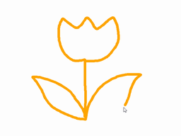</a> スケッチブック| 画像ビューア|<a href="Examples/AudioSpectrum.md" target="_blank">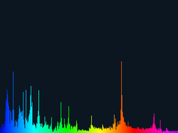</a> オーディオスペクトラム|
| マイク入力スペクトラム|<a href="Examples/ReverseTextColor.md" target="_blank">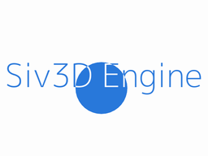</a> 文字色の反転|<a href="Examples/WeatherForecast.md" target="_blank">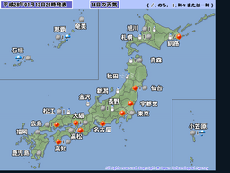</a> 天気予報|
| ドットお絵かき|<a href="Examples/15Puzzle.md" target="_blank">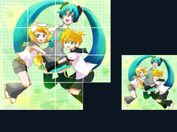</a> 15 パズル| ブロックくずし|
|<a href="Examples/Clock.md" target="_blank">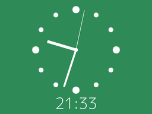</a> 時計|<a href="Examples/SoundPlayer.md" target="_blank">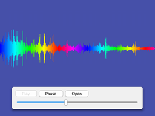</a> 音楽プレイヤー| ピアノ|
| ライフゲーム| XXXXXXXXX|<a href="Examples/Earth.md" target="_blank">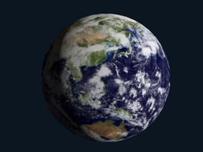</a> 地球|
|<a href="Examples/3DScene.md" target="_blank">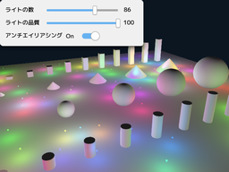</a> 3D シーン|<a href="Examples/LeapMotion.md" target="_blank">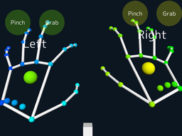</a> Leap Motion|<a href="Examples/Intersection3D.md" target="_blank">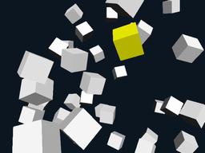</a> 3D 交差判定|
|<a href="Examples/WoodenMirror.md" target="_blank">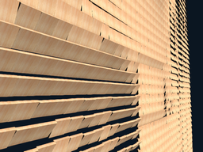</a> Wooden Mirror|<a href="Examples/BulletHell.md" target="_blank">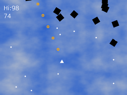</a> シューティングゲーム|<a href="Examples/ImageToPolygon.md" target="_blank">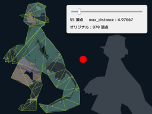</a> Image to Polygon|
| Sketch to Polygon| 軌跡|<a href="Examples/Plot3D.md" target="_blank">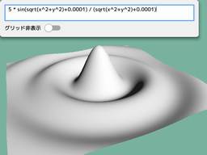</a> Plot3D|
| テンポとピッチの変更| 長方形の影| パーティクル|
| Polygon to Mesh| 3D テキスト| アプリ終了の確認|
| 地形| アーカイブファイル| GUI のアニメーション|
| Aero Glass エフェクト| Glitch| カラーパレット GUI|
| リンクテキスト| 付箋|<a href="Examples/XXXXXXXX.md" target="_blank">")</a> シーン切り替え(シルエット)|
| MIDI シーケンサー| 数つなぎ| 画面を揺らす|
| 対称定規| aobench| ?????|
| ?????| ?????| ?????|
 

## プログラミングガイド
- [Addon](Programming Guide/Addon.md)  
- [AnimatedGIFWriter](Programming Guide/AnimatedGIFWriter.md)  
- [ApplicationUtility](Programming Guide/ApplicationUtility.md)  
- AR  
- ArchivedFileReader  
- Array  
- Arrow  
- Asset  
- Base64  
- BinaryReader  
- BinaryWriter  
- BlendState  
- BoolArray  
- Box  
- Box2D Addon  
- ByteArray  
- CSVReader  
- CSVWriter  
- Camera  
- Char  
- CharacterSet  
- Circle  
- Circular  
- Clipboard  
- Color  
- CommandLine  
- Compression  
- Cone  
- Config  
- Console  
- ConstantBuffer  
- Crypto  
- CubicBezier  
- Cursor  
- CustomColor  
- CustomImage  
- Cylinder  
- Cylindrical  
- Date  
- DateTime  
- DepthStencilState  
- Dialog  
- Dialog  
- DirectXMathUtility  
- Disc  
- Distribution  
- Dragdrop  
- Duration  
- DynamicMesh  
- DynamicTexture  
- Easing  
- EasingController  
- Effect  
- Ellipse  
- EventTimer  
- ExpressionParser  
- FFT  
- FileArchive  
- FileMonitor  
- FileSystem  
- FloatShape  
- Fog  
- Font  
- FontAsset  
- Format  
- FormatInt  
- Fwd  
- GUI  
- GUIAsset  
- GUIButton  
- GUICheckBox  
- GUIColorPalette  
- GUIHorizontalLine  
- GUINewLine  
- GUIRadioButton  
- GUISlider  
- GUIText  
- GUITextArea  
- GUITextField  
- GUITexture  
- GUIToggleSwitch  
- Gamepad  
- Geometry2D  
- Geometry3D  
- Graphics  
- Graphics2D  
- Graphics3D  
- Grid  
- HSV  
- HTTPClient  
- HalfFloat  
- Handle  
- HandwritingRecognizer  
- HandwritingTrainer  
- HighPerfoemanceGraphics  
- INIReader  
- INIWriter  
- IReader  
- IWidget  
- IWriter  
- Image  
- Input  
- InputLayout  
- Internet  
- JSONReader  
- JSONValue  
- Key  
- KinectV1  
- KinectV2  
- KineticTypography  
- LeapMotion Addon  
- Lerp  
- Light  
- Line  
- Line  
- Line3D  
- LineString  
- Logger  
- Mat3x2  
- Mat4x4  
- Math  
- MathConstants  
- MediaPlayer  
- MemoryWriter  
- Mesh  
- MeshData  
- MessageBox  
- MD5  
- Midi  
- Model  
- ModelLoader  
- Mouse  
- MultiPolygon  
- Namespace  
- Network  
- Number  
- Optional  
- Parse  
- Particle  
- Pentablet  
- PerlinNoise  
- PixelShader  
- Plane  
- Point  
- PointVector  
- Polygon  
- PostEffect  
- Profiler  
- ProfilerUtility  
- PropertyMacro  
- PyFmt  
- QR  
- Quad  
- QuadraticBezier  
- Quaternion  
- Random  
- RasterizerState  
- Ray  
- Recorder  
- Rectangle  
- Regex  
- RenderState  
- RenderTexture  
- RoundRect   
- RNG  
- SamplerState  
- SceneManager
- ScreenCapture  
- Serial  
- Serialization  
- Shader  
- Shape  
- SIMD 
- Sound  
- SoundAsset  
- SoundBeat  
- Sphere  
- Spherical  
- Spline  
- Sprite  
- StaticAssertMacro  
- Step  
- Stopwatch  
- String  
- StringView  
- System  
- TCPClient  
- TCPServer  
- TextReader  
- TextWriter  
- Texture  
- TextureAsset  
- TextureFormat  
- TextureRegion  
- TexturedQuad  
- Threading  
- Time  
- TobiiEyeX  
- Touch  
- TransformedMesh  
- Triangle  
- Triangle3D  
- Twitter  
- Types  
- UID  
- Uncopyable  
- Unspecified  
- Utility  
- VariableSpeedStopwatch  
- Vector2D  
- Vector3D  
- Vector4D  
- Version  
- VertexShader  
- VideoPlayer  
- VideoReader  
- VideoWriter  
- Wave  
- WaveSample  
- WaveStretcher  
- Webcam  
- WidgetStyle  
- Window  
- XInput  
- XMLReader  
- ZIPReader  
- ZIPWriter  

