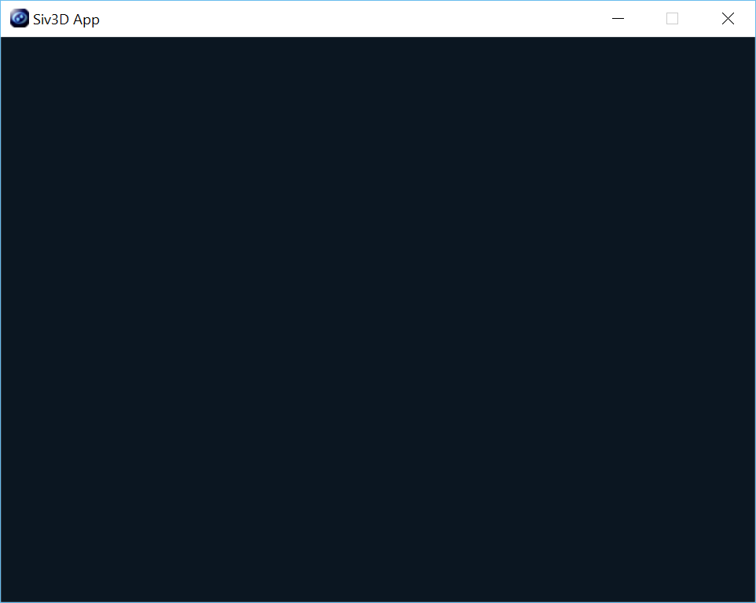

# 1. Siv3D の基本

## 最小限のプログラム

Siv3D のロゴを表示してすぐに終了する、一番短くて簡単なプログラムです。

```cpp
# include <Siv3D.hpp>

void Main()
{

}
```

## ウィンドウを表示しよう
  
**メインループ** `while (System::Update())` を書くと、**ウィンドウが閉じられる** か、**Esc キーが押される** までアプリケーションが実行し続けます。  
メインループは 1 フレームで 1 周、一般的なパソコンでは 1 秒間に最大 60 周実行されます。  
メインループ内にプログラムを書くことで、毎フレーム継続して絵を表示したり、入力を処理したりできます。

```cpp
# include <Siv3D.hpp>

void Main()
{
	while (System::Update())
	{

	}
}
```

## 画面の座標
  
ウィンドウ内の黒い部分が画面（**クライアント領域**）です。  
Siv3D ではクライアント領域に図形や画像を表示できます。  
クライアント領域上の位置を表す **座標系** は、**右方向が +X** , **下方向が +Y** です。  
特に指定しない限り、クライアント領域の大きさは **幅 640 ピクセル**, **高さ 480 ピクセル** です。  
したがって、一番左上の座標は (0,0)、右下の座標は (639,479) になります。  

## 動かそう
   
マウスカーソルに従って白い円が動くプログラムです。  
マウスカーソルの座標がオレンジ色の文字で表示されます。  
詳しい仕組みは次の章以降で説明されます。  

```cpp
# include <Siv3D.hpp>

void Main()
{
	const Font font(30);

	while (System::Update())
	{
		Circle(Mouse::Pos(), 100).draw();

		font(Mouse::Pos()).draw(50, 200, Palette::Orange);
	}
}
```

## カラフルにしよう
   
回転するカラフルな正方形を描いてみましょう。  
詳しい仕組みは次の章以降で説明されます。  

```cpp
# include <Siv3D.hpp>

void Main()
{
	Graphics::SetBackground(Palette::White);

	while (System::Update())
	{
		for (int32 i = 0; i < 36; ++i)
		{
			const double radian = Radians(i * 10 + System::FrameCount());

			const Vec2 pos = Circular(200, radian) + Window::Center();

			RectF(25).setCenter(pos).rotated(radian).draw(HSV(i * 10));
		}
	}
}
```

## １つだけ注意！
これから先に進むと登場する `Texture`, `DynamicTexture`, `Image`, `Sound`, `Wave`, `Font` といった型のデータは、画像や音楽を準備する処理に少し時間がかかります。  
メインループの中で、毎フレーム作成することは避けてください。
```cpp
// 間違ったプログラム
# include <Siv3D.hpp>

void Main()
{
	while (System::Update())
	{
		// NG! 毎フレーム テクスチャを作成する
		const Texture texture(L"Example/Windmill.png");

		// NG! 毎フレーム フォントを作成する
		const Font font(100);

		texture.draw();

		font(L"Hello").draw();
	}
}
```

メインループの前にあらかじめデータを用意すれば、時間のかかる処理は １ 度だけですみます。  
以下のような効率の良いプログラムを書きましょう。
```cpp
# include <Siv3D.hpp>

void Main()
{
	// OK! １度だけテクスチャを作成する
	const Texture texture(L"Example/Windmill.png");

	// OK! １度だけフォントを作成する
	const Font font(100);

	while (System::Update())
	{
		texture.draw();

		font(L"Hello").draw();
	}
}
```

**上級者向け** の機能ですが、**アセット管理** を使うと、同じデータを何度もロードするミスを防げるだけでなく、ロードしたデータにプログラムのどこからでもアクセスできるようになります。
```cpp
# include <Siv3D.hpp>

void Draw()
{
	TextureAsset(L"a").draw();

	FontAsset(L"b")(L"Hello").draw();
}

void Main()
{
	TextureAsset::Register(L"a", L"Example/Windmill.png");

	FontAsset::Register(L"b", 100);

	while (System::Update())
	{
		Draw();
	}
}
```

## ワイド文字って何？

Siv3D は文字の型に **ワイド文字** を使います。ワイド文字を使うには
```cpp
L"あいうえお", L"Hello, world!", L'A', L'3'
```
のように、文字や文字列のクオーテーションの前に `L` を置きます。  
ワイド文字には、ひらがなや漢字を wchar 型 1 要素で表現できる利点があり、日本語を含むテキストをプログラムで扱うのに適しています。  
   
```cpp
# include <Siv3D.hpp>

void Main()
{
	Graphics::SetBackground(Palette::White);

	const Font font(36);

	const String text = L"あいうえおかきくけこ";

	while (System::Update())
	{
		for (size_t i = 0; i < text.length; ++i)
		{
			font(text[i]).draw(i * 40, i * 40, HSV(i * 20));
		}
	}
}
```

「次の章へ進む」をクリックして、次のチュートリアルへ進みましょう。  

||　[- 目次 -](Index.md)　|　[次の章へ進む →](Draw-shape.md)
