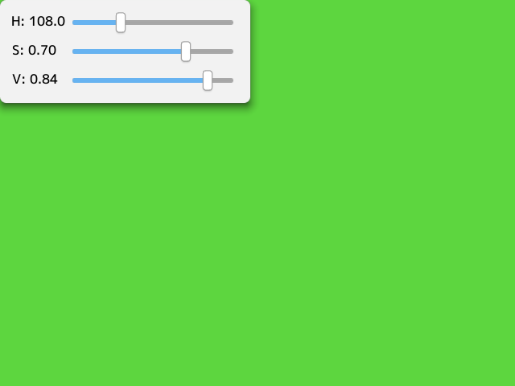

# 25. HSV カラー

## HSV とは
HSV とは、**色相（Hue）**, **彩度（Saturation）**, **明度（Value）** の 3 つの要素で色を表す方法です。  

色相は赤っぽい、青っぽいといった「色あい」を表します。色相を環状に並べたものを色相環といい、赤は 0°, 黄色は 60°といったように、円上の角度で表現されます。  
  
彩度は「鮮やかさ」を表します。色相が同じでも彩度が高ければ鮮やかに見え、低ければグレーに近くなります。彩度が 0 の場合は無彩色（黒、グレー、白）になります。  
明度は「明るさ」を表します。明度が高ければ明るい色に、低ければ暗い色になります。  

## HSV から Color への変換
  
これまで Color を使っていた場面で、代わりに HSV を使えます。  
H は色相を色相環上の角度で表し、S は 0.0～1.0 の範囲で彩度を, V は 0.0～1.0 の範囲で明度を表します。
```cpp
# include <Siv3D.hpp>

void Main()
{
	GUI gui(GUIStyle::Default);
	gui.add(L"H", GUIText::Create(L"", 60));
	gui.addln(L"H", GUISlider::Create(0.0, 360.0, 0.0, 200));
	gui.add(L"S", GUIText::Create(L"", 60));
	gui.addln(L"S", GUISlider::Create(0.0, 1.0, 1.0, 200));
	gui.add(L"V", GUIText::Create(L"", 60));
	gui.addln(L"V", GUISlider::Create(0.0, 1.0, 1.0, 200));

	while (System::Update())
	{
		const double h = gui.slider(L"H").value;
		const double s = gui.slider(L"S").value;
		const double v = gui.slider(L"V").value;

		gui.text(L"H").text = Format(L"H: {:.1f}"_fmt, h);
		gui.text(L"S").text = Format(L"S: {:.2f}"_fmt, s);
		gui.text(L"V").text = Format(L"V: {:.2f}"_fmt, v);

		Graphics::SetBackground(HSV(h, s, v));
	}
}
```

## HSV を使った描画のサンプル
  
```cpp
# include <Siv3D.hpp>

void Main()
{
	while (System::Update())
	{
		for (int32 y = 0; y < 12; ++y)
		{
			for (int32 x = 0; x < 16; ++x)
			{
				Rect(x * 40, y * 40, 40, 40).draw(HSV(x * 20, 1.0 - y / 12.0, 1.0));
			}
		}
	}
}
```

[← 前の章へ戻る](Stopwatch.md)　|　[- 目次 -](Index.md)　|　[次の章へ進む →](HTTPClient.md)