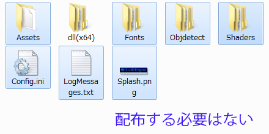

# 32. アプリケーションの公開

Siv3D で開発したアプリケーションを公開する際のガイドラインです。

## コンピューターのスペック
Siv3D で開発したアプリケーションを実行するには、次の環境が必要です。
- OS: Windows 7 SP1 / 8 / 8.1 / 10
- GPU: GeForce 8400 - / Radeon HD 2400 - / Intel HD Graphics
- (Windows 7 の場合) [最新の DirectX ランタイム](https://www.microsoft.com/ja-jp/download/details.aspx?id=35&)

## 配布に必要なファイル
配布するフォルダ内に以下のデータを配置します。
- アプリケーションの実行ファイル (.exe)
 - Release ビルドでは最小で 15MB 程度になります。(プログラムや埋め込んだファイルの量に応じて増加します）
 - 実行ファイルのターゲット (x86 または x64) は <a href="resource/Release/solutionplatform.png" target="_blank">ソリューションプラットフォーム</a> で設定します
 - x86 は 32bit / 64bit OS で動作し、x64 は 64bit OS でのみ動作します
- dll 以外を削除した Engine フォルダ
 - `dll(x86)` / `dll(x64)` フォルダ以外のファイル (Assets, Fonts, Shaders, Splash.png 等) は自動的に .exe に埋め込まれます
 - ターゲットが x86 (32bit) の場合 `dll(x64)` は不要です
 - ターゲットが x64 (64bit) の場合 `dll(x86)` は不要です
 - Config.ini は開発者向けのファイルのため、配布しません  
- アプリケーションが使う画像やサウンドなどのファイル（.exe に埋め込んでいなければ）
- （必要であれば）ユーザーに読んでもらうマニュアルや README などのドキュメント

以下のような配置になります。  
 
Web 上で公開する場合は、これらの親フォルダを zip 圧縮しましょう。

## ヒント

### Release ビルドにする
配布するアプリケーションは Visual Studio のソリューション構成を「Debug」ではなく「Release」にしてビルドしましょう。Release ビルドと Debug ビルドの違いは次の通りです。
- exe ファイルにデバッグ情報が埋め込まれないので、サイズが小さくなる
- 最適化された機械語が生成されるので実行速度が速くなる
- ソースコード中の assert が無視される
- ログに最小限の情報しか出力されなくなる

### アイコンを変える
アプリケーションのアイコンを変更するには、プロジェクトフォルダの icon.ico を新しい ico に置き換えて、プロジェクトをビルドします。icon.ico は .exe に埋め込まれるため、**配布する際に添付する必要はありません**。

### スプラッシュ画像を変える
オリジナルのロゴ画像を起動時に表示するには、Engine フォルダの Splash.png を新しい画像に置き換えてプロジェクトをビルドします。新しい Splash.png も .exe に埋め込まれるため、**配布する際に添付する必要はありません**。

### アプリケーション名
.exe ファイルの名前や、実行時にタスクマネージャーに表示されるアプリケーション名を変更するには、Visual Studio のソリューションエクスプローラーのプロジェクト名を変更します。

### ウィンドウのタイトル
ウィンドウに表示されるアプリケーションのタイトルは `Window::SetTitle(L"タイトル")` で設定します。

## 配布するファイルの数とサイズを極限まで削るには
いくつかの制約のもと、最小で 9 MB 程度（zip 圧縮すると 5 MB 程度）の .exe ファイル単体でアプリケーションの実行が可能です。

### dll の機能を使わない
dll が提供する機能をプログラムで使わない場合、該当する dll や Engine フォルダを添付する必要はありません。

| DLL | 添付しない場合の制約 |
|-----|-------------------|
| D3D | シェーダファイル (.hlsl) のコンパイルができません。`Shader::Compile()` でコンパイル済みのシェーダを使うことは可能です。 |
|libmpg123| MP3 ファイルのロード速度が低下します。また、MP3 のデコード結果が若干異なる場合があります。 |
|libqrencode| `QR::MinimumVersion()` 及び `QR::Encode()` が使用できません。QR コードの読み取りは可能です。 |
|SoundTouch| `WaveStretcher` クラス、`Sound::changePitch()`, `Sound::changeTempo()` が使用できません。 |
|TobiiEyeX| `TobiiEyeX::` 名前空間の関数が使用できません。 |

### 埋め込みファイルを削る
`Resource.rc` で設定されている、Engine 関連の埋め込みファイルのうち `// Optional` 以下に記述されているものについては、該当ファイルを使わない場合、`//` でコメントアウトすると埋め込みをキャンセルできます。

| ファイル | 埋め込まない場合の制約 |
|---------|--------------------|
| Engine/Objdetect/facePhoto.zip | `Imageing::DetectFaces()` で、`CascadeType::Photo` が使用できません。 |
| Engine/Objdetect/faceAnime.zip | `Imageing::DetectFaces()` で、`CascadeType::Anime` が使用できません。 |
| Engine/Fonts/mplus-1p-thin.zip | `Typeface::Thin` が使用できません。 |
| Engine/Fonts/mplus-1p-light.zip | `Typeface::Light` が使用できません。 |
| Engine/Fonts/mplus-1p-regular.zip | `Typeface::Regular` が使用できません。 |
| Engine/Fonts/mplus-1p-bold.zip | `Typeface::Bold` が使用できません。 |
| Engine/Fonts/mplus-1p-black.zip | `Typeface::Black` が使用できません。 |
| Icon.ico | アプリケーションのアイコンが設定されません。 |
| Engine/Splash.png | スプラッシュ画像が表示されません。 |

以上の制約のもと、9 MB 程度（zip 圧縮すると 5 MB 程度）の .exe ファイル単体でアプリケーションの実行が可能です。

[← 前の章へ戻る](Screen-capture.md)　|　[- 目次 -](Index.md)　|　[次の章へ進む →](Learn.md)
