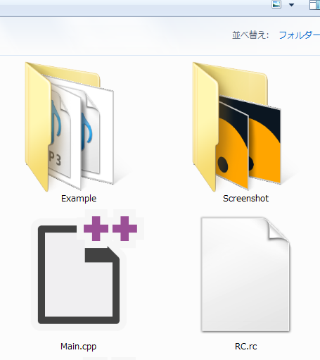

# 31. スクリーンショット

## PrintScreen キーでスクリーンショットを保存する
  
PrintScreen キーを押すと自動でスクリーンショットが保存されます。  
保存先は実行ファイルのディレクトリの Screenshot フォルダです。  
この機能をオフにしたい場合は `ScreenCapture::EnableScreenshot(false)` を呼びます。

## Ctrl + PrintScreen キーでプレイムービーをキャプチャする
Ctrl + PrintScreen キーを押すと自動でプレイムービーの録画が開始します。  
録画はアプリが終了するか、もう一度 Ctrl + PrintScreen キーが押されるまで続きます。  
保存先は実行ファイルのディレクトリの Screenshot フォルダです。  
この機能をオフにしたい場合は `ScreenCapture::EnableVideoCapture(false)` を呼びます。

[← 前の章へ戻る](Particle.md)　|　[- 目次 -](Index.md)　|　[次の章へ進む →](Release.md)