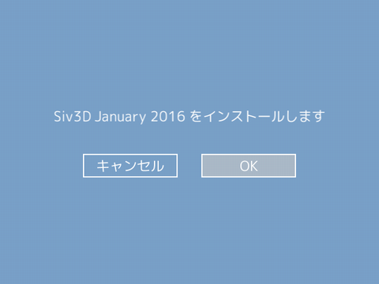

# 簡易インストーラ
## 1. Siv3D のインストール
- <a href="http://siv3d.jp/downloads/Siv3D/Siv3D_Installer.exe" target="_blank">Siv3D インストーラ</a> をダウンロードして実行します

  
- OK を押します

  
- この画面が表示されたらインストールは完了です。PC を再起動してください
 - 自動インストールでエラーが発生した場合は <a href="Manual-setup.md">手動でのセットアップ</a> を行ってください

## 2. プロジェクトの作成
- Visual Studio 2015 を起動し、メニューから | ファイル | → | 新規作成 | → | プロジェクト | を選択します

- | ▼テンプレート | → | ▼Visual C++ | の一覧にある | Siv3D(January2016) | を選択します

-  プロジェクト名を入力して | OK | を押します

- Main.cpp に以下のコードか用意されているので、ビルド・実行します
 - PC を再起動していない場合、&lt;Siv3D.hpp&gt; が見つからないというエラーが出ることがあります。PC を再起動すれば解決します

```cpp
# include <Siv3D.hpp>

void Main()
{
	const Font font(30);

	while (System::Update())
	{
		font(L"ようこそ、Siv3D の世界へ！").draw();

		Circle(Mouse::Pos(), 50).draw({ 255, 0, 0, 127 });
	}
}
```
おめでとうございます！最初の Siv3D プログラムが動きました。

## 3. Siv3D を楽しもう
Siv3D の基本的な機能とプログラムの書き方を体験しましょう。  
トップページに戻り、チュートリアルに進んでください。
