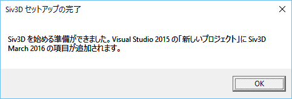

# インストールの手順
## 1. Siv3D のインストール
- <a href="http://siv3d.jp/downloads/Siv3D/Siv3DPackage(March2016).zip" target="_blank">Siv3D Package をダウンロード</a> し、適当なディレクトリに解凍します
 - Google Chrome ではダウンロードいただけません (※インストーラの相性の問題です)
 - インストール後は解凍したフォルダを移動させないでください

- Siv3D_Install.wsf を実行して、数秒待ちます　(<a href="Troubleshooting.md" target="_blank">:warning: 実行できない場合</a>) 

  
- この画面が表示されたらインストールは完了です
 - エラーが発生した場合は <a href="Manual-setup.md">手動でのインストール</a> を試してください

## 2. プロジェクトの作成
- Visual Studio 2015 を起動し、メニューから | ファイル | → | 新規作成 | → | プロジェクト | を選択します

- | ▼テンプレート | → | ▼Visual C++ | の一覧にある | Siv3D(March2016) | を選択します

-  プロジェクト名を入力して | OK | を押します　(<a href="Troubleshooting.md" target="_blank">:warning: 作成に失敗する場合</a>) 

- Main.cpp に以下のコードか用意されているので、ビルド・実行します　(<a href="Troubleshooting.md" target="_blank">:warning: Main.cpp が見つからない、ビルドに失敗する場合</a>) 

```cpp
# include <Siv3D.hpp>

void Main()
{
	const Font font(30);

	while (System::Update())
	{
		font(L"ようこそ、Siv3D の世界へ！").draw();

		Circle(Mouse::Pos(), 50).draw({ 255, 0, 0, 127 });
	}
}
```
おめでとうございます！最初の Siv3D プログラムが動きました:satisfied:  
<a href="../../../README.md" target="_blank">トップページ</a> からチュートリアルに進んでください。
