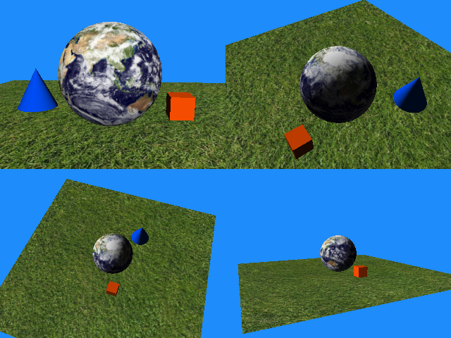
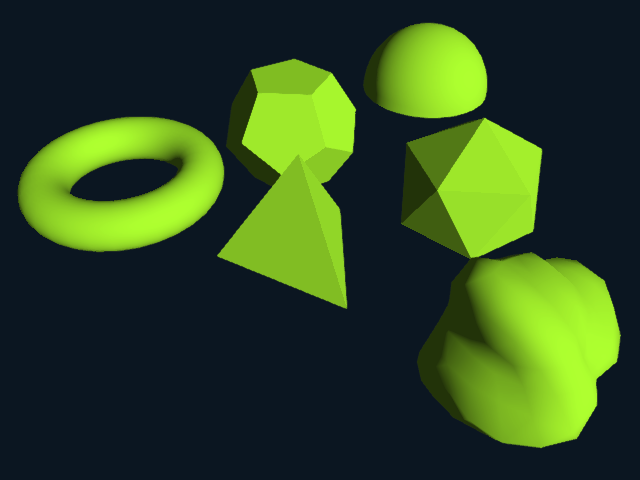

# Siv3D March 2016 おもな新機能サンプル

## パイプサーバー
標準入出力を行うコンソールアプリケーションと通信ができます。PipeServer から起動したアプリケーションは通常は非表示で実行されます。
```cpp
# include <Siv3D.hpp>

/* [クライアント]
# include <iostream>
# include <string>
# include <sstream>

int main()
{
	std::string input;

	while (std::getline(std::cin, input))
	{
		if (input == "quit")
		{
			return 0;
		}

		int a, b;

		std::stringstream{ input } >> a >> b;

		std::cout << a * b << '\n';
	}

	std::cout << "error\n";
}
*/

void Main()
{
	// クライアントのコンソールアプリケーションを選択
	const auto path = Dialog::GetOpen({ { L"実行ファイル (*.exe)", L"*.exe" } });

	if (!path)
	{
		return;
	}

    // クライアントを起動
	PipeServer server(path.value());

	if (!server)
	{
		return;
	}
	//
	///////////////////////////////////

	while (System::Update())
	{
		if (Input::KeyA.clicked)
		{
			Print(L"10*2=");

			server.write("10 2\n");
		}

		if (Input::KeyB.clicked)
		{
			Print(L"3*4=");

			server.write("3 4\n");
		}

		if (server.available())
		{
			std::string str;

			server.read(str);

			Print(Widen(str));
		}
	}

	server.write("quit\n");
}
```

## Forward Rendering 時の Viewport 設定
  
```cpp
# include <Siv3D.hpp>

void DrawScene()
{
	Plane(20).drawForward(TextureAsset(L"Grass"));
	Sphere(0, 2, 0, 2).drawForward(TextureAsset(L"Earth"));
	Box(3, 0.5, 1, 1).drawForward(Color(255, 80, 0));
	Cone(-4, 0, 2, 1, 2).drawForward(Color(0, 80, 255));
}

void Main()
{
	Graphics::SetBackground(Color(30, 140, 250));
	TextureAsset::Register(L"Grass", L"Example/Grass.jpg", TextureDesc::For3D);
	TextureAsset::Register(L"Earth", L"Example/Earth.jpg", TextureDesc::For3D);

	Camera cameraA, cameraB, cameraC;
	cameraA.lookat.set(0, 2, 0);
	cameraA.pos.set(4, 10, 6);

	cameraB.lookat.set(0, 2, 0);
	cameraB.pos.set(9, 20, 3);
	
	cameraC.lookat.set(0, 2, 0);
	cameraC.pos.set(20, 5, -10);

	while (System::Update())
	{
		Graphics3D::SetViewportForward(Rect(0, 0, 320, 240));
		Graphics3D::FreeCamera();	
		DrawScene();

		Graphics3D::SetViewportForward(Rect(320, 0, 320, 240));
		Graphics3D::SetCamera(cameraA);
		DrawScene();

		Graphics3D::SetViewportForward(Rect(0, 240, 320, 240));
		Graphics3D::SetCamera(cameraB);
		DrawScene();

		Graphics3D::SetViewportForward(Rect(320, 240, 320, 240));
		Graphics3D::SetCamera(cameraC);
		DrawScene();
	}
}
```

## MeshData の形状追加
  
```cpp
# include <Siv3D.hpp>

void Main()
{
	const Mesh mesh1(MeshData::Torus(1, 0.3));
	const Mesh mesh2(MeshData::Dodecahedron(1));
	const Mesh mesh3(MeshData::Hemisphere(1));
	const Mesh mesh4(MeshData::Tetrahedron(1));
	const Mesh mesh5(MeshData::Icosahedron(1));
	DynamicMesh mesh6(MeshData::Rock(1, 1));

	Graphics3D::SetAmbientLight(ColorF(0.2));
	const Color color = Palette::Greenyellow;

	while (System::Update())
	{
		Graphics3D::FreeCamera();

		if (Input::MouseR.clicked)
		{
			mesh6.fill(MeshData::Rock(1, Random(100000)));
		}

		Graphics3D::SetRasterizerState(Input::MouseL.pressed ? RasterizerState::WireframeCullNone : RasterizerState::Default3D);

		mesh1.translated(-2.5, 0, 0).draw(color);
		mesh2.translated(0, 0, 0).draw(color);
		mesh3.translated(2.5, 0, 0).draw(color);

		mesh4.translated(-1.25, 0, -2.5).draw(color);
		mesh5.translated(1.25, 0, -2.5).draw(color);

		mesh6.translated(0, 0, -4.5).draw(color);
	}
}
```
